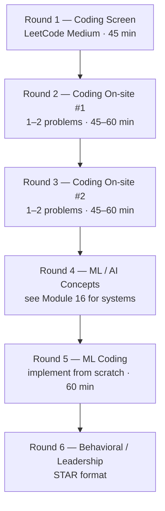
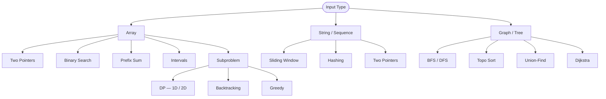
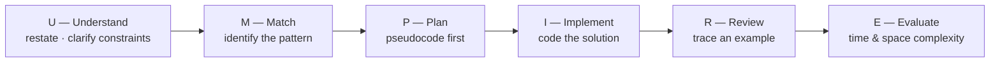

# Module 17: LeetCode Interview Prep for AI Engineers

> **Target Roles:** AI Engineer, ML Engineer, Research Engineer at Google DeepMind, Meta AI, OpenAI, Anthropic, Apple ML, Amazon/AWS AI, Microsoft AI, NVIDIA, Databricks, Hugging Face
> **Estimated Study Time:** 8–12 weeks (2–3 hours/day)

---

## What AI Engineer Interviews Look Like

AI engineer roles at top companies test the **same DSA fundamentals** as software engineering roles, but with additional nuance:



**Key differences vs. SWE interviews:**

- Python is strongly preferred (know it deeply)
- NumPy/matrix operation questions appear at ML-focused companies
- Graph problems appear frequently (neural nets ARE computation graphs)
- Complexity analysis matters more — you should know O(n²) vs O(n log n) for training loops

---

## 17.1 The 14 Patterns That Cover 90% of Problems

Rather than grinding 400 random problems, learn these 14 patterns. Every LeetCode problem maps to one or more of them.



---

## 17.2 Pattern 1: Arrays & Hashing

**Core idea:** Use a hash map to reduce O(n²) lookups to O(1). The most common pattern in interviews.

**Template:**

```python
def two_sum(nums: list[int], target: int) -> list[int]:
    seen = {}  # val → index
    for i, num in enumerate(nums):
        complement = target - num
        if complement in seen:
            return [seen[complement], i]
        seen[num] = i
    return []
```

### Key Problems

| #   | Problem                      | Difficulty | Pattern        | Companies        |
| --- | ---------------------------- | ---------- | -------------- | ---------------- |
| 1   | Two Sum                      | Easy       | HashMap        | Everywhere       |
| 2   | Group Anagrams               | Medium     | Sort+HashMap   | Google, Facebook |
| 3   | Top K Frequent Elements      | Medium     | HashMap+Bucket | Amazon, Google   |
| 4   | Product of Array Except Self | Medium     | Prefix/Suffix  | Facebook, Amazon |
| 5   | Valid Sudoku                 | Medium     | HashSet        | Apple            |
| 6   | Longest Consecutive Sequence | Medium     | HashSet        | Google           |

### Deep Dive: Product of Array Except Self

**Why AI engineers see this:** Tests your understanding of prefix/suffix accumulation — the same pattern used in attention score normalisation and prefix sums in cumulative probability distributions.

```python
def product_except_self(nums: list[int]) -> list[int]:
    n = len(nums)
    result = [1] * n

    # Left prefix products: result[i] = product of nums[0..i-1]
    prefix = 1
    for i in range(n):
        result[i] = prefix
        prefix *= nums[i]

    # Right suffix products: multiply into result[i]
    suffix = 1
    for i in range(n - 1, -1, -1):
        result[i] *= suffix
        suffix *= nums[i]

    return result
# Time: O(n), Space: O(1) excluding output
```

**Reasoning pattern:** "I need product of everything _except_ index i. Split into what's to the left and what's to the right. Compute each independently in a single pass."

---

## 17.3 Pattern 2: Two Pointers

**Core idea:** Use two indices moving toward each other (or same direction) to eliminate nested loops. Requires sorted input or a clear ordering invariant.

**Template:**

```python
def two_sum_sorted(nums: list[int], target: int) -> list[int]:
    left, right = 0, len(nums) - 1
    while left < right:
        curr = nums[left] + nums[right]
        if curr == target:
            return [left + 1, right + 1]
        elif curr < target:
            left += 1   # need larger value
        else:
            right -= 1  # need smaller value
    return []
```

### Key Problems

| #   | Problem                   | Difficulty | Notes                        |
| --- | ------------------------- | ---------- | ---------------------------- |
| 1   | Valid Palindrome          | Easy       | Classic left/right           |
| 2   | Two Sum II (Sorted)       | Medium     | Left/right pointing          |
| 3   | 3Sum                      | Medium     | Fix one, two-pointer on rest |
| 4   | Container With Most Water | Medium     | Shrink smaller side          |
| 5   | Trapping Rain Water       | Hard       | Max left/right arrays        |

### Deep Dive: Trapping Rain Water

**Why AI engineers see this:** Tests prefix max / suffix max thinking. Same pattern appears in 1D signal processing and time-series analysis.

```python
def trap(height: list[int]) -> int:
    n = len(height)
    if n == 0:
        return 0

    # For each position: water = min(max_left, max_right) - height[i]
    left_max = [0] * n
    right_max = [0] * n

    left_max[0] = height[0]
    for i in range(1, n):
        left_max[i] = max(left_max[i-1], height[i])

    right_max[n-1] = height[n-1]
    for i in range(n-2, -1, -1):
        right_max[i] = max(right_max[i+1], height[i])

    water = 0
    for i in range(n):
        water += min(left_max[i], right_max[i]) - height[i]

    return water
# Time: O(n), Space: O(n)
# Optimal: O(1) space with two-pointer approach
```

**Two-pointer O(1) space version:**

```python
def trap_optimal(height: list[int]) -> int:
    left, right = 0, len(height) - 1
    left_max = right_max = 0
    water = 0
    while left < right:
        if height[left] <= height[right]:
            if height[left] >= left_max:
                left_max = height[left]
            else:
                water += left_max - height[left]
            left += 1
        else:
            if height[right] >= right_max:
                right_max = height[right]
            else:
                water += right_max - height[right]
            right -= 1
    return water
```

---

## 17.4 Pattern 3: Sliding Window

**Core idea:** Maintain a window `[left, right]` and expand/contract it. Avoids re-computing from scratch for each subarray.

**Template — variable size window:**

```python
def longest_substring_without_repeat(s: str) -> int:
    char_index = {}
    left = 0
    max_len = 0
    for right, char in enumerate(s):
        if char in char_index and char_index[char] >= left:
            left = char_index[char] + 1  # shrink window
        char_index[char] = right
        max_len = max(max_len, right - left + 1)
    return max_len
# Time: O(n), Space: O(min(n, 26))
```

### Key Problems

| #   | Problem                                 | Difficulty | Companies        |
| --- | --------------------------------------- | ---------- | ---------------- |
| 1   | Best Time to Buy/Sell Stock             | Easy       | Everywhere       |
| 2   | Longest Substring Without Repeating     | Medium     | Google, Amazon   |
| 3   | Longest Repeating Character Replacement | Medium     | Google           |
| 4   | Permutation in String                   | Medium     | Google, Facebook |
| 5   | Minimum Window Substring                | Hard       | Google, Facebook |
| 6   | Sliding Window Maximum                  | Hard       | Google           |

### Deep Dive: Minimum Window Substring

```python
from collections import Counter

def min_window(s: str, t: str) -> str:
    if not t or not s:
        return ""

    need = Counter(t)           # {char: count needed}
    have = {}                    # {char: count in window}
    formed = 0                   # chars with sufficient count in window
    required = len(need)         # distinct chars needed

    left = 0
    min_len = float('inf')
    result = ""

    for right, char in enumerate(s):
        have[char] = have.get(char, 0) + 1
        if char in need and have[char] == need[char]:
            formed += 1

        # Try to shrink window
        while formed == required:
            # Update result
            if right - left + 1 < min_len:
                min_len = right - left + 1
                result = s[left:right + 1]

            # Remove leftmost char
            left_char = s[left]
            have[left_char] -= 1
            if left_char in need and have[left_char] < need[left_char]:
                formed -= 1
            left += 1

    return result
# Time: O(|s| + |t|), Space: O(|s| + |t|)
```

---

## 17.5 Pattern 4: Binary Search

**Core idea:** On a sorted (or monotonic) domain, binary search reduces O(n) to O(log n). The pattern extends beyond sorted arrays — any problem where you can define a predicate that is False...False...True...True can use binary search.

**Generalized template:**

```python
def binary_search_template(nums: list[int], target: int) -> int:
    left, right = 0, len(nums) - 1
    while left <= right:
        mid = left + (right - left) // 2   # avoid overflow
        if nums[mid] == target:
            return mid
        elif nums[mid] < target:
            left = mid + 1
        else:
            right = mid - 1
    return -1  # or left for insertion point
```

### Key Problems

| #   | Problem                                 | Difficulty | Notes                   |
| --- | --------------------------------------- | ---------- | ----------------------- |
| 1   | Binary Search                           | Easy       | Template baseline       |
| 2   | Search in Rotated Sorted Array          | Medium     | Determine sorted half   |
| 3   | Find Minimum in Rotated Sorted Array    | Medium     | Classic                 |
| 4   | Search a 2D Matrix                      | Medium     | Flatten the matrix      |
| 5   | Koko Eating Bananas                     | Medium     | Binary search on answer |
| 6   | Minimum in Rotated Array II (with dups) | Hard       | Tricky edge cases       |
| 7   | Median of Two Sorted Arrays             | Hard       | Google, Amazon          |

### Deep Dive: Binary Search on the Answer (Koko Eating Bananas)

This technique — "binary search on the answer space" — appears in many AI engineering problems (e.g., "find the minimum batch size that finishes training within X hours").

```python
import math

def min_eating_speed(piles: list[int], h: int) -> int:
    # Binary search on the speed k (1 to max(piles))
    # Predicate: can Koko eat all bananas at speed k within h hours?
    def can_finish(k: int) -> bool:
        return sum(math.ceil(pile / k) for pile in piles) <= h

    left, right = 1, max(piles)
    while left < right:
        mid = (left + right) // 2
        if can_finish(mid):
            right = mid      # might do better, search left
        else:
            left = mid + 1   # too slow, need faster
    return left
# Time: O(n log m) where m = max(piles)
```

**The pattern:** When the problem asks for "minimum X such that condition holds" or "maximum X such that condition holds", binary search on X if the condition is monotonic.

---

## 17.6 Pattern 5: Stack & Monotonic Stack

**Core idea:** A stack for LIFO processing; a monotonic stack maintains elements in sorted order, enabling O(n) solution for "next greater/smaller element" problems.

### Key Problems

| #   | Problem                        | Difficulty | Companies      |
| --- | ------------------------------ | ---------- | -------------- |
| 1   | Valid Parentheses              | Easy       | Everywhere     |
| 2   | Min Stack                      | Medium     | Amazon         |
| 3   | Daily Temperatures             | Medium     | Google, Amazon |
| 4   | Car Fleet                      | Medium     | Google         |
| 5   | Largest Rectangle in Histogram | Hard       | Google         |

### Deep Dive: Daily Temperatures (Monotonic Stack)

```python
def daily_temperatures(temps: list[int]) -> list[int]:
    """
    For each day, find the number of days until a warmer temperature.
    Monotonic stack: maintain indices of days with decreasing temperatures.
    When we see a warmer temperature, resolve all colder days.
    """
    n = len(temps)
    result = [0] * n
    stack = []  # stack of indices (temperatures are decreasing)

    for i, temp in enumerate(temps):
        # Pop all days that are colder than today
        while stack and temps[stack[-1]] < temp:
            prev_day = stack.pop()
            result[prev_day] = i - prev_day
        stack.append(i)

    return result
# Time: O(n), Space: O(n)
```

**Largest Rectangle in Histogram** — appears at Google/Facebook. Also the base for many matrix area problems:

```python
def largest_rectangle(heights: list[int]) -> int:
    stack = []  # (index, height) — monotonically increasing
    max_area = 0

    for i, h in enumerate(heights):
        start = i
        while stack and stack[-1][1] > h:
            j, bar_h = stack.pop()
            max_area = max(max_area, bar_h * (i - j))
            start = j  # can extend back to j
        stack.append((start, h))

    # Process remaining bars (extend to end)
    for j, h in stack:
        max_area = max(max_area, h * (len(heights) - j))

    return max_area
# Time: O(n), Space: O(n)
```

---

## 17.7 Pattern 6: Linked Lists

**Core idea:** Pointer manipulation. Know these in your sleep: reversing, finding the middle, detecting cycles, merging.

### Key Problems

| #   | Problem                       | Difficulty | Companies            |
| --- | ----------------------------- | ---------- | -------------------- |
| 1   | Reverse Linked List           | Easy       | Everywhere           |
| 2   | Merge Two Sorted Lists        | Easy       | Google, Amazon       |
| 3   | Reorder List                  | Medium     | Facebook             |
| 4   | Remove N-th Node from End     | Medium     | Amazon               |
| 5   | Add Two Numbers               | Medium     | Facebook, Apple      |
| 6   | Copy List with Random Pointer | Medium     | Google               |
| 7   | LRU Cache                     | Medium     | Google, Amazon, Meta |
| 8   | Merge K Sorted Lists          | Hard       | Google, LinkedIn     |

### Deep Dive: LRU Cache

**Why AI engineers see this:** LRU cache is directly relevant to KV-cache eviction in LLM serving. Understanding it signals ML systems awareness.

```python
from collections import OrderedDict

class LRUCache:
    """
    O(1) get and put using OrderedDict (doubly linked list + hashmap).
    Most recently used = last position, least recently = first.
    """
    def __init__(self, capacity: int):
        self.cap = capacity
        self.cache = OrderedDict()  # key → value

    def get(self, key: int) -> int:
        if key not in self.cache:
            return -1
        self.cache.move_to_end(key)  # mark as recently used
        return self.cache[key]

    def put(self, key: int, value: int) -> None:
        if key in self.cache:
            self.cache.move_to_end(key)
        self.cache[key] = value
        if len(self.cache) > self.cap:
            self.cache.popitem(last=False)  # evict LRU (first item)
```

**From-scratch implementation (doubly linked list + hashmap):**

```python
class Node:
    def __init__(self, key=0, val=0):
        self.key, self.val = key, val
        self.prev = self.next = None

class LRUCacheManual:
    def __init__(self, capacity: int):
        self.cap = capacity
        self.cache = {}
        # Sentinel head and tail for easy insertion/deletion
        self.head = Node()  # LRU end
        self.tail = Node()  # MRU end
        self.head.next = self.tail
        self.tail.prev = self.head

    def _remove(self, node: Node):
        node.prev.next = node.next
        node.next.prev = node.prev

    def _insert_at_tail(self, node: Node):
        prev = self.tail.prev
        prev.next = node
        node.prev = prev
        node.next = self.tail
        self.tail.prev = node

    def get(self, key: int) -> int:
        if key not in self.cache:
            return -1
        node = self.cache[key]
        self._remove(node)
        self._insert_at_tail(node)
        return node.val

    def put(self, key: int, value: int) -> None:
        if key in self.cache:
            self._remove(self.cache[key])
        node = Node(key, value)
        self.cache[key] = node
        self._insert_at_tail(node)
        if len(self.cache) > self.cap:
            lru = self.head.next
            self._remove(lru)
            del self.cache[lru.key]
```

---

## 17.8 Pattern 7: Trees

**Three traversals you must know cold:**

```python
class TreeNode:
    def __init__(self, val=0, left=None, right=None):
        self.val = val
        self.left = left
        self.right = right

# Recursive DFS traversals
def inorder(root):    # Left → Root → Right (sorted for BST)
    if not root: return []
    return inorder(root.left) + [root.val] + inorder(root.right)

def preorder(root):   # Root → Left → Right (good for copying/serialization)
    if not root: return []
    return [root.val] + preorder(root.left) + preorder(root.right)

def postorder(root):  # Left → Right → Root (good for deletion/height)
    if not root: return []
    return postorder(root.left) + postorder(root.right) + [root.val]

# BFS (Level Order)
from collections import deque
def level_order(root):
    if not root: return []
    queue = deque([root])
    result = []
    while queue:
        level = []
        for _ in range(len(queue)):  # process one level at a time
            node = queue.popleft()
            level.append(node.val)
            if node.left:  queue.append(node.left)
            if node.right: queue.append(node.right)
        result.append(level)
    return result
```

### Key Problems

| #   | Problem                               | Difficulty | Companies         |
| --- | ------------------------------------- | ---------- | ----------------- |
| 1   | Invert Binary Tree                    | Easy       | Google (famously) |
| 2   | Maximum Depth of Binary Tree          | Easy       | Amazon            |
| 3   | Same Tree                             | Easy       | Amazon            |
| 4   | Subtree of Another Tree               | Easy       | Amazon            |
| 5   | Lowest Common Ancestor                | Medium     | Google, Facebook  |
| 6   | Binary Tree Level Order Traversal     | Medium     | Everywhere        |
| 7   | Binary Tree Right Side View           | Medium     | Facebook          |
| 8   | Count Good Nodes                      | Medium     | Google            |
| 9   | Validate BST                          | Medium     | Amazon, Google    |
| 10  | Kth Smallest in BST                   | Medium     | Google            |
| 11  | Construct Tree from Inorder+Preorder  | Medium     | Google            |
| 12  | Max Path Sum                          | Hard       | Google, Facebook  |
| 13  | Serialize and Deserialize Binary Tree | Hard       | Google            |

### Deep Dive: Maximum Path Sum

**Why AI engineers see this:** Tests your ability to think about recursive subproblems that contribute to a global maximum — exactly how you think about backpropagation and gradient accumulation.

```python
def max_path_sum(root: TreeNode) -> int:
    """
    Path can start and end at any node.
    Key insight: at each node, we have two choices:
      1. Extend through this node (use both children + node value)  → contributes to global max only
      2. Return max single branch to parent (can only go one way up)
    """
    max_sum = float('-inf')

    def dfs(node) -> int:
        nonlocal max_sum
        if not node:
            return 0
        # Only take positive contributions from children
        left_gain  = max(dfs(node.left),  0)
        right_gain = max(dfs(node.right), 0)

        # Update global max: use both branches through this node
        max_sum = max(max_sum, node.val + left_gain + right_gain)

        # Return max single-branch gain to parent
        return node.val + max(left_gain, right_gain)

    dfs(root)
    return max_sum
```

---

## 17.9 Pattern 8: Graphs

**Why this is critical for AI engineers:** Neural networks are computation graphs. GNNs operate on graphs. Knowledge graphs underpin RAG systems. Graph algorithms show up constantly.

**Graph representations:**

```python
# Adjacency list (most common)
graph = {
    0: [1, 2],
    1: [0, 3],
    2: [0, 4],
    3: [1],
    4: [2]
}

# From edge list
from collections import defaultdict
def build_adj(n: int, edges: list) -> dict:
    adj = defaultdict(list)
    for u, v in edges:
        adj[u].append(v)
        adj[v].append(u)  # remove for directed graph
    return adj
```

**BFS template:**

```python
from collections import deque

def bfs(graph: dict, start: int) -> list[int]:
    visited = set([start])
    queue = deque([start])
    order = []
    while queue:
        node = queue.popleft()
        order.append(node)
        for neighbor in graph[node]:
            if neighbor not in visited:
                visited.add(neighbor)
                queue.append(neighbor)
    return order
```

**DFS template:**

```python
def dfs(graph: dict, node: int, visited: set) -> None:
    visited.add(node)
    for neighbor in graph[node]:
        if neighbor not in visited:
            dfs(graph, neighbor, visited)
```

### Key Problems

| #   | Problem                         | Difficulty | Pattern          | Companies        |
| --- | ------------------------------- | ---------- | ---------------- | ---------------- |
| 1   | Number of Islands               | Medium     | DFS/BFS on grid  | Amazon, Google   |
| 2   | Clone Graph                     | Medium     | BFS + HashMap    | Facebook         |
| 3   | Pacific Atlantic Water Flow     | Medium     | Multi-source BFS | Google           |
| 4   | Course Schedule                 | Medium     | Topo Sort/Cycle  | Google, Facebook |
| 5   | Course Schedule II              | Medium     | Topo Sort        | Google           |
| 6   | Graph Valid Tree                | Medium     | Union-Find       | LinkedIn         |
| 7   | Number of Connected Components  | Medium     | Union-Find       | LinkedIn         |
| 8   | Word Ladder                     | Hard       | BFS + word graph | Amazon, Google   |
| 9   | Alien Dictionary                | Hard       | Topo Sort        | Airbnb, Google   |
| 10  | Network Delay Time (Dijkstra)   | Medium     | Weighted BFS     | Google           |
| 11  | Cheapest Flights (Bellman-Ford) | Medium     | k-step BFS       | Google           |
| 12  | Reconstruct Itinerary           | Hard       | Eulerian path    | Google           |

### Deep Dive: Topological Sort (Course Schedule)

**Why AI engineers see this:** Topological ordering is exactly the execution order in a neural network's computation graph (forward pass respects DAG ordering). Dependency resolution in ML pipelines.

```python
from collections import deque

def find_order(num_courses: int, prerequisites: list) -> list[int]:
    """
    Topological sort using Kahn's algorithm (BFS on in-degrees).
    Returns course ordering, or [] if there's a cycle.
    """
    adj = defaultdict(list)
    in_degree = [0] * num_courses

    for course, prereq in prerequisites:
        adj[prereq].append(course)
        in_degree[course] += 1

    # Start with all courses that have no prerequisites
    queue = deque([i for i in range(num_courses) if in_degree[i] == 0])
    order = []

    while queue:
        course = queue.popleft()
        order.append(course)
        for next_course in adj[course]:
            in_degree[next_course] -= 1
            if in_degree[next_course] == 0:
                queue.append(next_course)

    return order if len(order) == num_courses else []
    # If len(order) < num_courses → cycle exists → impossible

# Time: O(V + E), Space: O(V + E)
```

**DFS-based topo sort with cycle detection:**

```python
def can_finish(num_courses: int, prerequisites: list) -> bool:
    adj = defaultdict(list)
    for course, prereq in prerequisites:
        adj[prereq].append(course)

    # 0 = unvisited, 1 = in current path (cycle!), 2 = done
    state = [0] * num_courses

    def has_cycle(node: int) -> bool:
        if state[node] == 1: return True   # cycle!
        if state[node] == 2: return False  # already cleared

        state[node] = 1  # mark in-progress
        for neighbor in adj[node]:
            if has_cycle(neighbor):
                return True
        state[node] = 2  # mark done
        return False

    return not any(has_cycle(i) for i in range(num_courses))
```

### Union-Find (Disjoint Set Union)

Used for connected components, cycle detection in undirected graphs:

```python
class UnionFind:
    def __init__(self, n: int):
        self.parent = list(range(n))
        self.rank = [0] * n
        self.components = n

    def find(self, x: int) -> int:
        if self.parent[x] != x:
            self.parent[x] = self.find(self.parent[x])  # path compression
        return self.parent[x]

    def union(self, x: int, y: int) -> bool:
        px, py = self.find(x), self.find(y)
        if px == py:
            return False  # already connected (cycle in undirected graph)
        # Union by rank
        if self.rank[px] < self.rank[py]:
            px, py = py, px
        self.parent[py] = px
        if self.rank[px] == self.rank[py]:
            self.rank[px] += 1
        self.components -= 1
        return True
```

---

## 17.10 Pattern 9: Heap / Priority Queue

**Core idea:** A heap (min or max) allows O(1) access to the min/max element and O(log n) insertion. Use for k-th element problems, merging sorted lists, streaming medians.

```python
import heapq

# Python always gives MIN heap
# For max heap, negate all values
min_heap = []
heapq.heappush(min_heap, 3)
heapq.heappush(min_heap, 1)
heapq.heappush(min_heap, 2)
print(heapq.heappop(min_heap))  # 1 (minimum)

# K largest elements
def k_largest(nums: list[int], k: int) -> list[int]:
    return heapq.nlargest(k, nums)  # O(n log k)

# Using heap manually (most interview questions require this)
def top_k_frequent(nums: list[int], k: int) -> list[int]:
    count = Counter(nums)
    # Min heap of size k: when heap > k, pop smallest frequency
    heap = []
    for num, freq in count.items():
        heapq.heappush(heap, (freq, num))
        if len(heap) > k:
            heapq.heappop(heap)
    return [num for freq, num in heap]
```

### Key Problems

| #   | Problem                      | Difficulty | Companies        |
| --- | ---------------------------- | ---------- | ---------------- |
| 1   | Kth Largest Element in Array | Medium     | Google, Facebook |
| 2   | K Closest Points to Origin   | Medium     | Google, Amazon   |
| 3   | Task Scheduler               | Medium     | Facebook         |
| 4   | Design Twitter Feed          | Medium     | Twitter/X        |
| 5   | Find Median from Data Stream | Hard       | Google           |
| 6   | Merge K Sorted Lists         | Hard       | Google           |

### Deep Dive: Find Median from Data Stream

**Why AI engineers see this:** Online statistics, streaming ML metrics, running quantiles. The two-heap trick is elegant.

```python
class MedianFinder:
    """
    Two heaps: max-heap for lower half, min-heap for upper half.
    Invariant: len(lo) == len(hi) or len(lo) == len(hi) + 1
    Median: lo[0] if odd total, else (lo[0] + hi[0]) / 2
    """
    def __init__(self):
        self.lo = []  # max-heap (negate for Python min-heap)
        self.hi = []  # min-heap

    def add_num(self, num: int) -> None:
        # Always push to lo first
        heapq.heappush(self.lo, -num)
        # Balance: lo's max must be <= hi's min
        if self.lo and self.hi and (-self.lo[0]) > self.hi[0]:
            heapq.heappush(self.hi, -heapq.heappop(self.lo))
        # Rebalance sizes
        if len(self.lo) > len(self.hi) + 1:
            heapq.heappush(self.hi, -heapq.heappop(self.lo))
        if len(self.hi) > len(self.lo):
            heapq.heappush(self.lo, -heapq.heappop(self.hi))

    def find_median(self) -> float:
        if len(self.lo) > len(self.hi):
            return -self.lo[0]
        return (-self.lo[0] + self.hi[0]) / 2.0
```

---

## 17.11 Pattern 10: Dynamic Programming

**The most important pattern for FAANG/top-company interviews.** DP solves problems with overlapping subproblems and optimal substructure.

**Decision framework:**

```
Is this a DP problem?
  ✓ Asked for a count, maximum, minimum, or True/False
  ✓ Choices at each step affect future choices
  ✓ Can break into subproblems with recurrence

Approach:
  1. Define state: dp[i] = answer for subproblem of size i
  2. Write recurrence: dp[i] = f(dp[i-1], dp[i-2], ...)
  3. Base cases
  4. Fill order (top-down with memoization OR bottom-up tabulation)
```

### 1D DP Problems

```python
# Climbing Stairs — how many ways to climb n stairs (1 or 2 steps):
def climb_stairs(n: int) -> int:
    if n <= 2: return n
    a, b = 1, 2
    for _ in range(3, n + 1):
        a, b = b, a + b
    return b
# dp[n] = dp[n-1] + dp[n-2]  → Fibonacci pattern

# House Robber — max money without robbing adjacent houses:
def rob(nums: list[int]) -> int:
    prev2, prev1 = 0, 0
    for num in nums:
        prev2, prev1 = prev1, max(prev1, prev2 + num)
    return prev1
# dp[i] = max(dp[i-1], dp[i-2] + nums[i])

# Coin Change — minimum coins to make amount:
def coin_change(coins: list[int], amount: int) -> int:
    dp = [float('inf')] * (amount + 1)
    dp[0] = 0
    for a in range(1, amount + 1):
        for coin in coins:
            if coin <= a:
                dp[a] = min(dp[a], 1 + dp[a - coin])
    return dp[amount] if dp[amount] != float('inf') else -1
# Time: O(amount * len(coins)), Space: O(amount)
```

### 2D DP Problems

```python
# Longest Common Subsequence — crucial for tokenization, diff algorithms
def lcs(text1: str, text2: str) -> int:
    m, n = len(text1), len(text2)
    dp = [[0] * (n + 1) for _ in range(m + 1)]

    for i in range(1, m + 1):
        for j in range(1, n + 1):
            if text1[i-1] == text2[j-1]:
                dp[i][j] = 1 + dp[i-1][j-1]
            else:
                dp[i][j] = max(dp[i-1][j], dp[i][j-1])

    return dp[m][n]

# Edit Distance (Levenshtein) — appears in NLP, spell correction, tokenization
def min_distance(word1: str, word2: str) -> int:
    m, n = len(word1), len(word2)
    dp = [[0] * (n + 1) for _ in range(m + 1)]

    # Base cases: converting to/from empty string
    for i in range(m + 1): dp[i][0] = i
    for j in range(n + 1): dp[0][j] = j

    for i in range(1, m + 1):
        for j in range(1, n + 1):
            if word1[i-1] == word2[j-1]:
                dp[i][j] = dp[i-1][j-1]
            else:
                dp[i][j] = 1 + min(
                    dp[i-1][j],   # delete from word1
                    dp[i][j-1],   # insert into word1
                    dp[i-1][j-1]  # replace
                )
    return dp[m][n]
```

### Key DP Problems

| #   | Problem                               | Difficulty | Pattern               | Companies        |
| --- | ------------------------------------- | ---------- | --------------------- | ---------------- |
| 1   | Climbing Stairs                       | Easy       | 1D Fibonacci          | Everywhere       |
| 2   | House Robber                          | Medium     | 1D linear             | Amazon           |
| 3   | Coin Change                           | Medium     | 1D unbounded knapsack | Google, Amazon   |
| 4   | Longest Increasing Subsequence        | Medium     | 1D + binary search    | Google           |
| 5   | Longest Common Subsequence            | Medium     | 2D string DP          | Google           |
| 6   | Edit Distance                         | Medium     | 2D string DP          | Google, Facebook |
| 7   | Unique Paths                          | Medium     | 2D grid DP            | Google           |
| 8   | Maximal Square                        | Medium     | 2D grid DP            | Facebook         |
| 9   | Best Time to Buy/Sell (with cooldown) | Medium     | State machine DP      | Amazon           |
| 10  | Word Break                            | Medium     | 1D + trie             | Google           |
| 11  | Palindromic Substrings                | Medium     | 2D string DP          | Facebook         |
| 12  | Burst Balloons                        | Hard       | Interval DP           | Google           |
| 13  | Regular Expression Matching           | Hard       | 2D DP                 | Google, Facebook |

### Deep Dive: Longest Increasing Subsequence (LIS)

**Why AI engineers see this:** LIS appears in scheduling, version ordering, and curriculum learning (ordering examples by difficulty).

```python
# O(n²) DP solution
def length_of_lis_n2(nums: list[int]) -> int:
    n = len(nums)
    dp = [1] * n  # dp[i] = LIS ending at index i
    for i in range(1, n):
        for j in range(i):
            if nums[j] < nums[i]:
                dp[i] = max(dp[i], dp[j] + 1)
    return max(dp)

# O(n log n) solution using binary search (patience sorting)
import bisect
def length_of_lis(nums: list[int]) -> int:
    tails = []  # tails[i] = smallest tail for IS of length i+1
    for num in nums:
        pos = bisect.bisect_left(tails, num)
        if pos == len(tails):
            tails.append(num)  # extend IS
        else:
            tails[pos] = num   # replace (keep smallest possible tail)
    return len(tails)
```

---

## 17.12 Pattern 11: Backtracking

**Core idea:** Build a solution incrementally, abandon ("prune") branches that can't lead to a valid solution.

**Template:**

```python
def backtrack(state, choices, result):
    if is_complete(state):
        result.append(state.copy())
        return
    for choice in choices:
        if is_valid(state, choice):
            make_choice(state, choice)
            backtrack(state, remaining_choices, result)
            undo_choice(state, choice)  # BACKTRACK
```

### Key Problems

| #   | Problem                     | Difficulty | Companies         |
| --- | --------------------------- | ---------- | ----------------- |
| 1   | Subsets                     | Medium     | Google            |
| 2   | Permutations                | Medium     | Google, Facebook  |
| 3   | Combination Sum             | Medium     | Google            |
| 4   | Letter Combinations (Phone) | Medium     | Google, Amazon    |
| 5   | Palindrome Partitioning     | Medium     | Facebook          |
| 6   | N-Queens                    | Hard       | Google            |
| 7   | Sudoku Solver               | Hard       | Google            |
| 8   | Word Search                 | Medium     | Microsoft, Amazon |

### Deep Dive: Combination Sum

```python
def combination_sum(candidates: list[int], target: int) -> list[list[int]]:
    result = []
    candidates.sort()  # enable pruning

    def backtrack(start: int, current: list, remaining: int):
        if remaining == 0:
            result.append(current[:])
            return
        for i in range(start, len(candidates)):
            if candidates[i] > remaining:
                break  # PRUNE: sorted, so all later candidates also too large
            current.append(candidates[i])
            backtrack(i, current, remaining - candidates[i])  # can reuse same element
            current.pop()  # BACKTRACK

    backtrack(0, [], target)
    return result
```

---

## 17.13 Pattern 12: Tries

**Why AI engineers MUST know this:** Tokenizers, autocomplete, prefix filtering, vocabulary lookups, word-level NLP. Appears frequently at Google, Apple, and AI-focused companies.

```python
class TrieNode:
    def __init__(self):
        self.children = {}
        self.is_end = False

class Trie:
    def __init__(self):
        self.root = TrieNode()

    def insert(self, word: str) -> None:
        node = self.root
        for char in word:
            if char not in node.children:
                node.children[char] = TrieNode()
            node = node.children[char]
        node.is_end = True

    def search(self, word: str) -> bool:
        node = self.root
        for char in word:
            if char not in node.children:
                return False
            node = node.children[char]
        return node.is_end

    def starts_with(self, prefix: str) -> bool:
        node = self.root
        for char in prefix:
            if char not in node.children:
                return False
            node = node.children[char]
        return True
```

### Key Problems

| #   | Problem                         | Difficulty | Companies |
| --- | ------------------------------- | ---------- | --------- |
| 1   | Implement Trie                  | Medium     | Google    |
| 2   | Design Add and Search Words     | Medium     | Facebook  |
| 3   | Word Search II (find all words) | Hard       | Google    |
| 4   | Auto-Complete Search System     | Hard       | Google    |

---

## 17.14 Pattern 13: Intervals

**Core idea:** Merge, insert, or schedule non-overlapping intervals. Sort by start time.

```python
def merge_intervals(intervals: list[list[int]]) -> list[list[int]]:
    intervals.sort(key=lambda x: x[0])
    merged = [intervals[0]]
    for start, end in intervals[1:]:
        if start <= merged[-1][1]:  # overlaps
            merged[-1][1] = max(merged[-1][1], end)
        else:
            merged.append([start, end])
    return merged
```

### Key Problems

| #   | Problem                                | Difficulty | Companies          |
| --- | -------------------------------------- | ---------- | ------------------ |
| 1   | Merge Intervals                        | Medium     | Google, Facebook   |
| 2   | Insert Interval                        | Medium     | Google             |
| 3   | Non-overlapping Intervals              | Medium     | Amazon             |
| 4   | Meeting Rooms II (min rooms)           | Medium     | Facebook (premium) |
| 5   | Minimum Interval to Include Each Query | Hard       | Google             |

---

## 17.15 Pattern 14: Math & Bit Manipulation

```python
# Single Number (every element appears twice except one)
def single_number(nums: list[int]) -> int:
    result = 0
    for num in nums:
        result ^= num  # XOR: a XOR a = 0, 0 XOR a = a
    return result

# Count bits set in integer
def hammingWeight(n: int) -> int:
    count = 0
    while n:
        n &= (n - 1)  # clear lowest set bit
        count += 1
    return count

# Power of two
def isPowerOfTwo(n: int) -> bool:
    return n > 0 and (n & (n - 1)) == 0
```

---

## 17.16 AI/ML-Specific Coding Problems

These appear at OpenAI, Anthropic, Google DeepMind, Meta AI, and other ML-focused companies during the "ML coding" round.

### Matrix Operations

```python
# Spiral Matrix — appears frequently (convolution, attention patterns)
def spiral_order(matrix: list[list[int]]) -> list[int]:
    result = []
    top, bottom = 0, len(matrix) - 1
    left, right = 0, len(matrix[0]) - 1

    while top <= bottom and left <= right:
        # Right across top
        for col in range(left, right + 1):
            result.append(matrix[top][col])
        top += 1

        # Down right side
        for row in range(top, bottom + 1):
            result.append(matrix[row][right])
        right -= 1

        # Left across bottom
        if top <= bottom:
            for col in range(right, left - 1, -1):
                result.append(matrix[bottom][col])
            bottom -= 1

        # Up left side
        if left <= right:
            for row in range(bottom, top - 1, -1):
                result.append(matrix[row][left])
            left += 1

    return result
```

### Implement Neural Net Forward Pass

```python
# Implement a 2-layer feedforward network from scratch (appears at Anthropic/OpenAI)
import numpy as np

class TwoLayerNet:
    def __init__(self, input_dim: int, hidden_dim: int, output_dim: int):
        # He initialization for ReLU
        self.W1 = np.random.randn(input_dim, hidden_dim) * np.sqrt(2 / input_dim)
        self.b1 = np.zeros(hidden_dim)
        self.W2 = np.random.randn(hidden_dim, output_dim) * np.sqrt(2 / hidden_dim)
        self.b2 = np.zeros(output_dim)

    def relu(self, x):
        return np.maximum(0, x)

    def softmax(self, x):
        exp_x = np.exp(x - np.max(x, axis=-1, keepdims=True))
        return exp_x / exp_x.sum(axis=-1, keepdims=True)

    def forward(self, X):
        self.z1 = X @ self.W1 + self.b1        # (batch, hidden)
        self.h1 = self.relu(self.z1)            # (batch, hidden)
        self.z2 = self.h1 @ self.W2 + self.b2   # (batch, output)
        self.output = self.softmax(self.z2)     # (batch, output)
        return self.output
```

### Implement Scaled Dot-Product Attention

```python
# Appears at OpenAI, Anthropic, Google DeepMind
def scaled_dot_product_attention(Q, K, V, mask=None):
    """
    Q: (batch, seq, d_k)
    K: (batch, seq, d_k)
    V: (batch, seq, d_v)
    """
    import numpy as np
    d_k = Q.shape[-1]
    scores = Q @ K.transpose(0, 2, 1) / np.sqrt(d_k)   # (batch, seq, seq)
    if mask is not None:
        scores = np.where(mask, -1e9, scores)
    weights = np.exp(scores - scores.max(-1, keepdims=True))
    weights /= weights.sum(-1, keepdims=True)  # softmax
    return weights @ V                          # (batch, seq, d_v)
```

### Implement KMeans

```python
# Appears at ML-focused companies as a clustering/unsupervised problem
def kmeans(X: np.ndarray, k: int, max_iters: int = 100) -> tuple:
    """Returns centroids and assignments."""
    # Random initialization
    idx = np.random.choice(len(X), k, replace=False)
    centroids = X[idx].copy()

    for _ in range(max_iters):
        # Assign each point to nearest centroid
        dists = np.linalg.norm(X[:, None] - centroids[None], axis=-1)  # (n, k)
        assignments = dists.argmin(axis=-1)

        # Update centroids
        new_centroids = np.array([
            X[assignments == i].mean(axis=0) if (assignments == i).any()
            else centroids[i]
            for i in range(k)
        ])

        if np.allclose(centroids, new_centroids):
            break
        centroids = new_centroids

    return centroids, assignments
```

### Implement Top-K Sampling (Language Model Decoding)

```python
# Appears at LLM companies (OpenAI, Anthropic, Cohere, Mistral)
import numpy as np

def top_k_sample(logits: np.ndarray, k: int, temperature: float = 1.0) -> int:
    """Sample from top-k tokens given logits."""
    # Apply temperature
    logits = logits / temperature
    # Get top-k indices
    top_k_indices = np.argpartition(logits, -k)[-k:]
    top_k_logits = logits[top_k_indices]
    # Softmax over top-k
    top_k_logits -= top_k_logits.max()
    probs = np.exp(top_k_logits)
    probs /= probs.sum()
    # Sample
    return top_k_indices[np.random.choice(len(probs), p=probs)]

def top_p_sample(logits: np.ndarray, p: float = 0.9, temperature: float = 1.0) -> int:
    """Nucleus sampling: sample from the smallest set of tokens with cumulative prob >= p."""
    logits = logits / temperature
    # Sort descending
    sorted_indices = np.argsort(logits)[::-1]
    sorted_logits = logits[sorted_indices]
    # Softmax
    sorted_logits -= sorted_logits.max()
    probs = np.exp(sorted_logits)
    probs /= probs.sum()
    # Find nucleus
    cumprobs = np.cumsum(probs)
    nucleus_size = np.searchsorted(cumprobs, p) + 1
    nucleus_indices = sorted_indices[:nucleus_size]
    nucleus_probs = probs[:nucleus_size]
    nucleus_probs /= nucleus_probs.sum()
    return nucleus_indices[np.random.choice(nucleus_size, p=nucleus_probs)]
```

### Implement Tokenizer (BPE Step)

```python
# Understanding tokenization at implementation level — appears at NLP companies
from collections import Counter

def get_vocab(text: str) -> dict:
    """Initial vocabulary: each word split into characters, with end-of-word marker."""
    words = text.split()
    vocab = Counter()
    for word in words:
        word_chars = ' '.join(list(word)) + ' </w>'
        vocab[word_chars] += 1
    return vocab

def get_pairs(vocab: dict) -> dict:
    """Count all adjacent pair frequencies."""
    pairs = Counter()
    for word, freq in vocab.items():
        symbols = word.split()
        for i in range(len(symbols) - 1):
            pairs[(symbols[i], symbols[i + 1])] += freq
    return pairs

def merge_vocab(pair: tuple, vocab: dict) -> dict:
    """Merge most frequent pair into a single token in vocabulary."""
    import re
    pattern = re.escape(' '.join(pair))
    merged = ''.join(pair)
    new_vocab = {}
    for word in vocab:
        new_word = re.sub(pattern, merged, word)
        new_vocab[new_word] = vocab[word]
    return new_vocab

def bpe(text: str, num_merges: int) -> list:
    """Run BPE for num_merges iterations, return learned merge rules."""
    vocab = get_vocab(text)
    merges = []
    for _ in range(num_merges):
        pairs = get_pairs(vocab)
        if not pairs:
            break
        best_pair = max(pairs, key=pairs.get)
        vocab = merge_vocab(best_pair, vocab)
        merges.append(best_pair)
    return merges
```

---

## 17.17 Company-Specific Interview Patterns

### Google / Google DeepMind

- **Heavy on:** Trees, graphs (especially topo sort), DP, binary search on answer
- **Signature problems:** Word Ladder, Alien Dictionary, K Closest Points, Design Search Autocomplete
- **ML round:** Implement training loops, describe backprop mathematically, optimize inference latency
- **Tips:** Communicate big-O before coding. They care about clean code structure.

### Meta (Facebook) AI Research

- **Heavy on:** Arrays, graphs, trees (especially serialization/reconstruction)
- **Signature problems:** Serialize/Deserialize Binary Tree, LRU Cache, Regular Expression Matching
- **ML round:** Recommender systems, feed ranking, real-time feature computation
- **Tips:** Speed matters. Optimize for fewer lines of code. Know FB-specific ML scale.

### Apple ML

- **Heavy on:** Matrices, string processing, design problems
- **Signature problems:** Matrix-related (rotate, search), on-device ML constraints
- **ML round:** Privacy-preserving ML, on-device inference, Core ML integration
- **Tips:** Privacy and efficiency win points. Mention power consumption for ML inference.

### Amazon / AWS AI

- **Heavy on:** OOP design, linked lists, trees, DP
- **Signature problems:** LRU Cache, Design Twitter, Merge K Sorted Lists
- **ML round:** SageMaker pipeline design, distributed training, model endpoint latency
- **Tips:** Always connect to Leadership Principles. STAR format for behavioral.

### OpenAI / Anthropic

- **Heavy on:** ML fundamentals (implement from scratch), Python performance, system design
- **Signature problems:** Implement attention, write a tokenizer, implement autoregressive generation
- **ML round:** Deep dives on training dynamics, RLHF, safety considerations
- **Tips:** Expect to implement things at the numpy level. Read their papers before the interview.

### NVIDIA

- **Heavy on:** Parallel algorithms, GPU memory management, matrix operations
- **Signature problems:** Matrix multiplication variants, prefix scan, tiling
- **ML round:** CUDA optimization, memory bandwidth calculations, quantization
- **Tips:** Know FLOP/s vs bandwidth bottlenecks for ops. Know tensor cores.

### Databricks / Hugging Face / Scale AI

- **Heavy on:** Data processing, distributed systems, model evaluation
- **Signature problems:** Top-K, merge sorted, distributed word count
- **ML round:** Pipeline design, model serving, evaluation harnesses
- **Tips:** Know Apache Spark / pandas performance characteristics.

---

## 17.18 The 8-Week Study Plan

```
Week 1: Foundations (Arrays, Hashing, Two Pointers)
  Mon: Two Sum, Valid Anagram, Contains Duplicate
  Tue: Product of Array Except Self, Top K Frequent
  Wed: Encode/Decode Strings, Longest Consecutive
  Thu: Valid Palindrome, 3Sum, Container With Most Water
  Fri: Trapping Rain Water, review + re-solve from memory
  Sat: Mock interview (1 Medium problem, 40 min + review)

Week 2: Sliding Window + Binary Search
  Mon: Best Time to Buy Stock (I), Longest Substring No Repeat
  Tue: Longest Repeating Char Replacement, Permutation in String
  Wed: Minimum Window Substring, Sliding Window Maximum
  Thu: Binary Search, Search Rotated Array, Find Min in Rotated
  Fri: Search 2D Matrix, Koko Eating Bananas, Median of 2 Arrays
  Sat: Mock interview

Week 3: Stack + Linked Lists
  Mon: Valid Parentheses, Min Stack, Daily Temperatures
  Tue: Car Fleet, Largest Rectangle in Histogram
  Wed: Reverse Linked List, Merge Two Sorted Lists
  Thu: Reorder List, Remove Nth from End, Copy with Random Ptr
  Fri: Add Two Numbers, LRU Cache
  Sat: Mock interview

Week 4: Trees (Binary Trees + BST + Tries)
  Mon: Invert Binary Tree, Max Depth, Diameter of Binary Tree
  Tue: Balanced Binary Tree, Same Tree, Subtree of Another
  Wed: LCA, Level Order, Right Side View, Count Good Nodes
  Thu: Validate BST, Kth Smallest, Construct from Inorder+Preorder
  Fri: Max Path Sum, Serialize/Deserialize, Implement Trie
  Sat: Mock interview

Week 5: Graphs
  Mon: Number of Islands, Clone Graph, Max Area of Island
  Tue: Pacific Atlantic, Walls and Gates, Rotting Oranges
  Wed: Course Schedule I and II (topo sort)
  Thu: Number of Connected Components, Graph Valid Tree (Union-Find)
  Fri: Word Ladder, Alien Dictionary
  Sat: Mock interview + graph review

Week 6: Dynamic Programming (1D + 2D)
  Mon: Climbing Stairs, House Robber I and II, Coin Change
  Tue: Longest Increasing Subsequence, Word Break
  Wed: Unique Paths, Jump Game I and II
  Thu: Longest Common Subsequence, Edit Distance
  Fri: Matrix DP: Maximal Square, Burst Balloons
  Sat: Mock interview

Week 7: Heap/Priority Queue + Intervals + Backtracking
  Mon: Kth Largest in Array, K Closest Points, Task Scheduler
  Tue: Find Median from Data Stream, Merge K Sorted Lists
  Wed: Merge Intervals, Insert Interval, Non-Overlapping
  Thu: Subsets, Combinations, Permutations
  Fri: Combination Sum, Palindrome Partitioning, N-Queens
  Sat: Mock interview

Week 8: ML-Specific + Company Mock Interviews
  Mon: Implement attention mechanism from scratch
  Tue: Implement KMeans, implement logistic regression with SGD
  Wed: Implement LRU Cache from scratch, implement BPE tokenizer step
  Thu: Full 60-min mock: "Design a search ranking system" + 1 DP problem
  Fri: Full 60-min mock: "ML coding round" + system design
  Sat/Sun: Review weakest areas, re-do 5 problems you got wrong
```

---

## 17.19 Python Patterns Every AI Engineer Must Know

### Comprehensions & Generator Tricks

```python
# List comprehension with condition
squares_of_evens = [x**2 for x in range(20) if x % 2 == 0]

# Dict comprehension — build frequency map in one line
freq = {char: s.count(char) for char in set(s)}
# Better: Counter(s)

# Generator for memory-efficient processing
def token_batches(tokens, batch_size):
    for i in range(0, len(tokens), batch_size):
        yield tokens[i:i + batch_size]

# Zip, enumerate, and sorted with key
pairs = sorted(zip(scores, words), key=lambda x: -x[0])  # sort by score desc
```

### Collections Module (Know Cold)

```python
from collections import Counter, defaultdict, deque, OrderedDict

# Counter
c = Counter("programming")  # {'g': 2, 'r': 2, 'm': 2, ...}
c.most_common(3)             # top 3 elements

# defaultdict — avoids KeyError
graph = defaultdict(list)
graph[0].append(1)  # works even if 0 not in dict

# deque — O(1) popleft (list.pop(0) is O(n)!)
d = deque([1, 2, 3])
d.appendleft(0)    # O(1)
d.popleft()        # O(1)
```

### heapq Module

```python
import heapq

# Min heap
heap = []
heapq.heappush(heap, (priority, item))
priority, item = heapq.heappop(heap)

# Max heap trick: negate priorities
heapq.heappush(heap, (-priority, item))

# Heapify in-place: O(n)
heapq.heapify(nums)
```

### Bisect Module (Binary Search in Python)

```python
import bisect

nums = [1, 3, 4, 7, 9]
bisect.bisect_left(nums, 5)   # → 3 (insert 5 before index 3)
bisect.bisect_right(nums, 4)  # → 3 (insert 4 after existing 4s)
bisect.insort(nums, 5)        # insert maintaining sorted order
```

### String Operations

```python
s = "Hello World"
s.split()          # ['Hello', 'World']
" ".join(words)    # efficient string building
s.lower()          # "hello world"
s.strip()          # remove leading/trailing whitespace
s[::-1]            # reverse string
ord('a')           # 97 — char to ASCII
chr(97)            # 'a' — ASCII to char
```

---

## 17.20 Time & Space Complexity Cheat Sheet

**Data Structure Operations**

| Structure | Access | Search | Insert | Delete |
|-----------|--------|--------|--------|--------|
| Array / List | O(1) | O(n) | O(n) | O(n) |
| HashMap / Set | O(1) avg | O(1) | O(1) | O(1) |
| BST (balanced) | O(log n) | O(log n) | O(log n) | O(log n) |
| Min/Max Heap | O(1) top | O(n) | O(log n) | O(log n) |
| Trie | O(m) | O(m) | O(m) | O(m) |
| Graph (adj list) | O(V+E) | O(V+E) | O(1) | O(E) |

**Algorithm Complexities**

| Algorithm | Time | Space |
|-----------|------|-------|
| Binary Search | O(log n) | O(1) |
| BFS / DFS | O(V + E) | O(V) |
| Dijkstra (heap) | O(E log V) | O(V) |
| Topological Sort | O(V + E) | O(V) |
| Merge Sort | O(n log n) | O(n) |
| Quick Sort (avg) | O(n log n) | O(log n) |
| Heap Sort | O(n log n) | O(1) |
| Counting Sort | O(n + k) | O(k) |
| 2D DP (LCS, Edit Distance) | O(m × n) | O(m × n) |
| Backtracking (subsets) | O(2ⁿ) | O(n) |
| Backtracking (permutations) | O(n!) | O(n) |

---

## 17.21 Interview Communication Framework

The #1 reason candidates fail is not knowing the answer — it's _not communicating their thought process_.



**What to say at each stage:**

```
After reading the problem:
  "Let me make sure I understand. Given X, I need to return Y.
   What are the constraints on input size? Can the input be empty?
   Are values guaranteed to be positive?"

After identifying the pattern:
  "I think this is a sliding window problem because we need a
   contiguous subarray and we're optimizing some property.
   The brute force would be O(n²), but sliding window gets us O(n)."

Before coding:
  "My approach: maintain left and right pointers.
   I'll expand right until the window is invalid, then shrink left.
   Let me trace through your example first..."

After coding:
  "Let me trace through the example: input [2,3,1,2,4,3], target 7.
   Window starts empty... [walk through]... I get 2. ✓
   Time complexity is O(n) because each element enters and exits
   the window at most once. Space is O(1)."
```

---

## 17.22 The 50 Most Important Problems (Prioritized List)

### Tier 1 — Must Know Cold (Appears Everywhere)

| #   | Problem                             | Pattern             | Why It Matters           |
| --- | ----------------------------------- | ------------------- | ------------------------ |
| 1   | Two Sum                             | HashMap             | Foundational pattern     |
| 2   | Valid Parentheses                   | Stack               | Foundational             |
| 3   | Merge Two Sorted Lists              | Linked List         | Sorting building block   |
| 4   | Best Time to Buy & Sell Stock       | Sliding Window / DP | Classic optimization     |
| 5   | Invert Binary Tree                  | Tree DFS            | Google's famous problem  |
| 6   | Climbing Stairs                     | DP                  | Fibonacci / DP intro     |
| 7   | Binary Search                       | Binary Search       | Template baseline        |
| 8   | Longest Substring Without Repeating | Sliding Window      | Sliding window template  |
| 9   | Reverse Linked List                 | Linked List         | Core pointer manip       |
| 10  | Number of Islands                   | Graph DFS/BFS       | Graph traversal template |

### Tier 2 — High Frequency (Appear at FAANG)

| #   | Problem                      | Pattern              |
| --- | ---------------------------- | -------------------- |
| 11  | 3Sum                         | Two Pointers         |
| 12  | LRU Cache                    | LinkedList + HashMap |
| 13  | House Robber                 | 1D DP                |
| 14  | Course Schedule              | Topo Sort            |
| 15  | Product of Array Except Self | Prefix/Suffix        |
| 16  | Maximum Subarray (Kadane's)  | 1D DP / Greedy       |
| 17  | Coin Change                  | 1D DP                |
| 18  | Container With Most Water    | Two Pointers         |
| 19  | Validate BST                 | Tree DFS             |
| 20  | Word Break                   | DP + Trie            |
| 21  | Lowest Common Ancestor       | Tree DFS             |
| 22  | Merge Intervals              | Intervals            |
| 23  | Top K Frequent Elements      | Heap + HashMap       |
| 24  | Pacific Atlantic Water Flow  | Multi-source BFS     |
| 25  | Implement Trie               | Trie                 |
| 26  | Serialize/Deserialize Tree   | Tree BFS             |
| 27  | Alien Dictionary             | Topo Sort            |
| 28  | Trapping Rain Water          | Two Pointers         |
| 29  | Merge K Sorted Lists         | Heap                 |
| 30  | Longest Common Subsequence   | 2D DP                |

### Tier 3 — Differentiators (Separate Good from Great)

| #   | Problem                        | Pattern             |
| --- | ------------------------------ | ------------------- |
| 31  | Regular Expression Matching    | 2D DP               |
| 32  | Word Search II                 | Backtracking + Trie |
| 33  | Find Median from Data Stream   | Two Heaps           |
| 34  | Sliding Window Maximum         | Monotonic Deque     |
| 35  | Edit Distance                  | 2D DP               |
| 36  | N-Queens                       | Backtracking        |
| 37  | Largest Rectangle in Histogram | Monotonic Stack     |
| 38  | Burst Balloons                 | Interval DP         |
| 39  | Reverse Nodes in k-Group       | Linked List         |
| 40  | K-th Largest in Stream         | Heap                |

### ML-Specific (For AI Engineer Rounds)

| #   | Problem                                    | Skills Tested             |
| --- | ------------------------------------------ | ------------------------- |
| 41  | Implement softmax with numerical stability | NumPy + numerical methods |
| 42  | Implement attention mechanism              | Matrix ops understanding  |
| 43  | Top-K sampling from logits                 | Probability + heap        |
| 44  | Implement K-Means clustering               | Array manipulation        |
| 45  | Implement SGD optimizer step               | Gradient + numerical      |
| 46  | Sparse vector dot product                  | HashMap efficiency        |
| 47  | Matrix multiplication variants             | NumPy, O(n³) awareness    |
| 48  | Implement BPE merge step                   | String processing         |
| 49  | Cosine similarity search                   | Linear algebra            |
| 50  | Implement early stopping logic             | State machine / DP        |

---

## 17.23 Interview Anti-Patterns to Avoid

```
❌ Jumping straight to coding without clarifying constraints
❌ Writing code in silence — think out loud always
❌ Starting with a brute force and never improving it
❌ Not testing your code on the given example
❌ Forgetting edge cases: empty input, single element, all same values
❌ Using Python 2 syntax (print "x" instead of print("x"))
❌ Mutating input array without asking if that's okay
❌ Not knowing the time complexity of your solution
❌ Giving up when stuck — say "I'm not sure, but let me think about..."
❌ Not connecting your solution to the interviewer's follow-up hints

✓ Always restate the problem before diving in
✓ Write comments as you code
✓ Use meaningful variable names (not just 'i', 'j')
✓ Volunteer complexity analysis before being asked
✓ After solving, proactively suggest optimizations
✓ For ML rounds: connect to real ML systems you know
```

---

## Key Resources

- **LeetCode Patterns:** [Sean Prashad's List](https://seanprashad.com/leetcode-patterns/) — organized by pattern
- **NeetCode 150:** neetcode.io — curated 150 with video explanations
- **Grokking Algorithms** (book) — visual explanations for non-Googlers
- **Cracking the Coding Interview** (book) — behavioral + technical combined
- **Elements of Programming Interviews in Python** — hardest problems with Python
- **Blind 75:** The original curated list — still relevant
- **AlgoMonster:** Pattern-based learning with ML-specific problems
